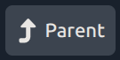

# Quanta Docs User Guide

**Quanta** Documents plugin is a powerful file system-based document editor that allows you to view, edit, and organize your documents and folders in a tree-like structure, similar to Jupyter Notebooks, but where each 'cell' is an actual file on the file system rather than a chunk of JSON in a monolithic document file like Jupyter uses. The app provides a comprehensive set of tools for managing your content, from simple text editing to advanced file operations, creating a Jupyter-like experience (block-based editor) but using your file system itself for storage.

## Getting Started

Using Quanta is much like browsing a File System, except that the content itself is being presented to you rather than just filenames. So Quanta is like a Wiki, or Document Editor/Publisher in that regard. Quanta presents your files and folders as a unified document view that you can browse around in. Each file in a folder is displayed as a separate section/cell, creating the appearance of one continuous document while maintaining individual file organization. At any given time you'll be viewing the content of a folder, but you'll be seeing all the markdown of all the files in that folder presented to you as a big editable document. So in the sense that you can edit online content this is similar to a Wiki.

### Navigation

#### Folder Navigation
- **Click on any folder** to navigate into it and view its contents
- **Use the Back button** in the header to return to the previous page
- **Parent folder navigation** - When viewing a subfolder, you can navigate up one level

#### File Structure

All files and folders use a 4-digit numeric prefix (e.g., "0001_", "0002_") that controls their display order. This numbering system ensures your content appears in a consistent, predictable sequence. When displayed to you, these numeric prefixes are hidden for a cleaner appearance.

## Viewing Modes

**Quanta** offers several viewing modes to suit different needs:

### Standard View Mode
In standard view, files are rendered as formatted Markdown content, providing a clean reading experience. Images are displayed inline with the text.

### Edit Mode
When **Edit Mode** is enabled via the checkbox in the header:
- Checkboxes appear next to each item for selection
- Edit controls become available for individual items
- Additional management buttons appear in the header
- Insert buttons appear between items for adding new content.

. 

When in edit move, above each File/Folder are buttons for editing that specific item.

| Icon | Action|
|---|---|
|  | Edits the file content or folder name |
|  | Deletes the file/folder |
|  | Moves the file/folder up or down |

Functions related to creating new files/folders are shown between each existing file/folder, so it's easy to insert new content at the correct ordinal where you want it.

| Icon | Action|
|---|---|
|  | Inserts an empty new Markdown file |
|  | Inserts a new Folder |
|  | Uploads from your device|
|  | Uploads what's in your clipboard |
|  | Start recording new TTS Note |

### Meta Mode
When **Meta Mode** is enabled:
- File modification dates are displayed
- Additional file metadata is shown
- Technical details about each file become visible

### Names Mode
When **Names Mode** is enabled:
- Files are displayed as clickable file names instead of rendered content
- Useful for quickly scanning file structures
- Images appear as thumbnails rather than full-size
- Provides a more compact, file-browser-like view

### View Width Control
A dropdown in the header allows you to adjust the content width:
- **Narrow**: Compact view for focused reading
- **Medium**: Balanced view (default)
- **Wide**: Expanded view for maximum content visibility

## Overall Page Layout

At the upper right of the page these are buttons for opening folders (if run locally only), followed by refresh, search, settings, report, and help buttons. Parent button takes you up one level on folder structure. These are general buttons about things at a higher level in the app.

When `Edit Mode` is enabled we get more buttons down the middle and on the right side of the page for various edit-related tasks.

| Icon | Action|
|---|---|
|  | Opens Folder with OS |
|  | Opens File with System Editor |
|  | Refreshes the page |
|  | Search current Folder |
|  | Opens User Preferences |
|  | Generate Website |
|  | Help for this Page |
|  | Go to Parent Folder |

## Creating Content

### Creating New Files
1. **Enable Edit Mode** using the checkbox in the header
2. **Click the plus (+) icon** that appears between existing items or at the top
3. A new file is automatically created with a default name
4. The file immediately opens in edit mode for you to add content
5. **Edit the filename** using the text field above the content area
6. **Add your content** in the text area below
7. **Click Save** to preserve your changes

.

| Icon | Action|
|---|---|
|  | Splits at '~' Delimiter |
|  | Convert to folder with files |
|  | Select Hashtags |
|  | Insert Timestamp at Cursor |
|  | TTS in realtime into textarea |

### Creating New Folders
1. **Enable Edit Mode**
2. **Click the folder icon** that appears next to the plus (+) icon
3. Enter a name for your new folder
4. **Click Create** to add the folder
5. The folder will appear in the list and can be clicked to navigate into it

### File Upload Features
The extension supports multiple ways to add files:

#### File Upload
1. **Enable Edit Mode**
2. **Click the upload icon** (appears next to other insert options)
3. **Select one or more files** from your computer
4. Files are automatically uploaded and added to the current folder

#### Clipboard Upload
1. **Copy an image or file** to your clipboard (Ctrl+C or Cmd+C)
2. **Enable Edit Mode**
3. **Click the clipboard upload icon**
4. The clipboard content is automatically uploaded as a file

## Editing Content

### Editing Files
1. **Enable Edit Mode**
2. **Click the edit icon** next to any file
3. The file switches to edit mode showing:
   - **Filename field** (at the top) - modify the file name if desired
   - **Content area** (below) - edit the file's content
4. **Make your changes** to either the filename or content
5. **Choose your save option**:
   - **Save**: Saves changes to the current file
   - **Split**: Saves content and splits it into multiple files (see Content Splitting below)
   - **Cancel**: Discards all changes

### Editing Folder Names
1. **Enable Edit Mode**
2. **Click the edit icon** next to any folder
3. **Enter the new folder name** in the text field
4. **Click Rename** to apply changes or **Cancel** to discard

### Content Splitting
When editing a file, you can use the **Split** feature to divide content into multiple files:
1. **Add the delimiter `\n~\n`** (newline, tilde, newline) in your content where you want splits to occur
2. **Click the Split button** instead of Save
3. The system automatically creates separate files for each section
4. Files are numbered sequentially and positioned appropriately in the folder

### Tag Selection
The Tag Selection feature allows you to quickly insert hashtags into your content while editing:

#### Using the Tag Selector
1. **Enable Edit Mode** and open any file for editing
2. **Click the Tags icon** (hashtag symbol) in the editing toolbar
3. **Select tags** from the available options using checkboxes
4. **Preview your selection** in the "Selected tags" section
5. **Click Add** to insert the selected tags at your cursor position
6. **Click Cancel** to close without adding tags

#### Tag Sources
The system provides tags in two ways:
- **Default Tags**: A built-in set of common hashtags is always available
- **Custom Tags**: If you create a hidden file named `.TAGS.md` in your document root, the system will automatically extract hashtags from this file and add them to the available options

#### Creating Custom Tags
To define your own tags:
1. **Create a file named `.TAGS.md`** in the root of your document folder
2. **Add hashtags** throughout the content (e.g., `#productivity`, `#documentation`, `#ideas`)
3. **Save the file** - the system will automatically detect and extract all hashtags
4. **Open the Tag Selector** - your custom tags will now appear alongside the default options

#### Tag Format
- Tags must start with a hashtag (#) followed by letters, numbers, hyphens, underscores, or forward slashes
- **Supported characters**: `a-z`, `A-Z`, `0-9`, `-`, `_`, `/`
- Examples: `#todo`, `#work-notes`, `#project_alpha`, `#version2`, `#project/frontend`, `#docs/user-guide`
- Tags are automatically sorted alphabetically in the selector
- Selected tags are inserted with spaces between them for easy reading

## File and Folder Management

### Selecting Items
In Edit Mode, use the checkboxes to select one or multiple items:
- **Individual selection**: Click the checkbox next to any item
- **Select all/none**: Use the master checkbox that appears when items are available
- **Selection counter**: Shows how many items are currently selected

### Moving Items
Individual items can be reordered using the move controls:
1. **Enable Edit Mode**
2. **Use the up/down arrow icons** next to each item
3. Items swap positions with their neighbors
4. The numeric ordering is automatically maintained

### Cutting and Pasting
Quanta supports cut-and-paste operations for moving items:

#### Cutting Items
1. **Select one or more items** using checkboxes
2. **Click the Cut button** in the header
3. Selected items are marked for moving (they remain visible but are marked as cut)

#### Pasting Items
After cutting items, you have several paste options:
- **Paste at top**: Use the paste button that appears at the top of the folder
- **Paste after specific item**: Use the paste button that appears below any item
- **Paste into folder**: Click the paste icon next to any folder to move items into that folder
- **Undo Cut**: Click the "Undo Cut" button to cancel the cut operation

### Deleting Items
1. **Select items** using checkboxes in Edit Mode
2. **Click the Delete button** in the header, or
3. **Use the delete icon** next to individual items
4. **Confirm deletion** in the dialog that appears
5. **Note**: Deletion is permanent and cannot be undone

### Joining Files
Multiple text files can be combined into one:
1. **Select multiple text files** (minimum 2) using checkboxes
2. **Click the Join button** in the header
3. Files are combined in ordinal order into the first selected file
4. All other selected files are automatically deleted after joining

## Search Functionality

### Accessing Search
1. **Click the search icon** in the header to open the Search page
2. The search operates within the current folder and its subfolders

### Search Options
The search feature offers three modes:
- **Match Any**: Finds content containing any of the entered words
- **Match All**: Finds content containing all of the entered words
- **REGEX**: Allows advanced pattern matching using regular expressions

### Using Search Results
1. **Enter your search query** in the text field
2. **Select your preferred search mode**
3. **Click Search** or press Enter
4. **Click on any search result** to:
   - Navigate directly to the folder containing that file
   - Automatically scroll to the specific file in the document view

## Advanced Features

### File System Integration
For administrators with desktop access:
- **File system editor**: Opens your system's default file editor
- **Explore folder**: Opens the current folder in your file manager (desktop mode only)

### Static Site Generation
The **Generate Static Site** button (cube icon) creates a static HTML version of your document structure, useful for publishing or sharing.

### Refresh and Sync
- **Refresh button** (sync icon): Manually refresh the current folder view
- The interface automatically updates when changes are made

### Keyboard Shortcuts
- **Enter key**: Execute search when in the search field
- **ESC key**: Cancel edit operations
- **Tab key**: Navigate between form fields during editing

## Tips and Best Practices

### Organization
- Use descriptive folder and file names
- Leverage the automatic numbering system to control content order
- Consider using the Meta Mode to review file modification dates

### Content Management
- Use the Split feature to break large documents into manageable sections
- Take advantage of the Join feature to consolidate related content
- Use Cut and Paste for efficient reorganization

### Workflow Efficiency
- Enable Names Mode for quick file structure overview
- Use search functionality to quickly locate specific content
- Take advantage of upload features for adding external content

### File Naming
- While numeric prefixes are used internally, focus on meaningful names for the content portion
- File extensions are automatically added (.md for text files) if not specified
- Avoid special characters that might cause issues with file systems

